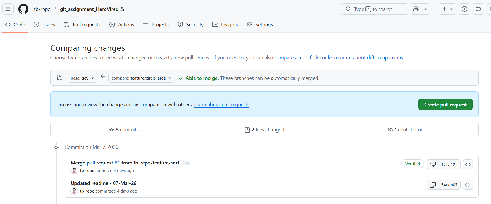
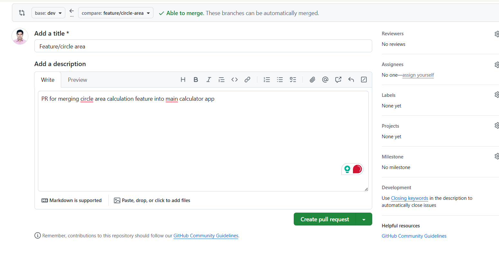
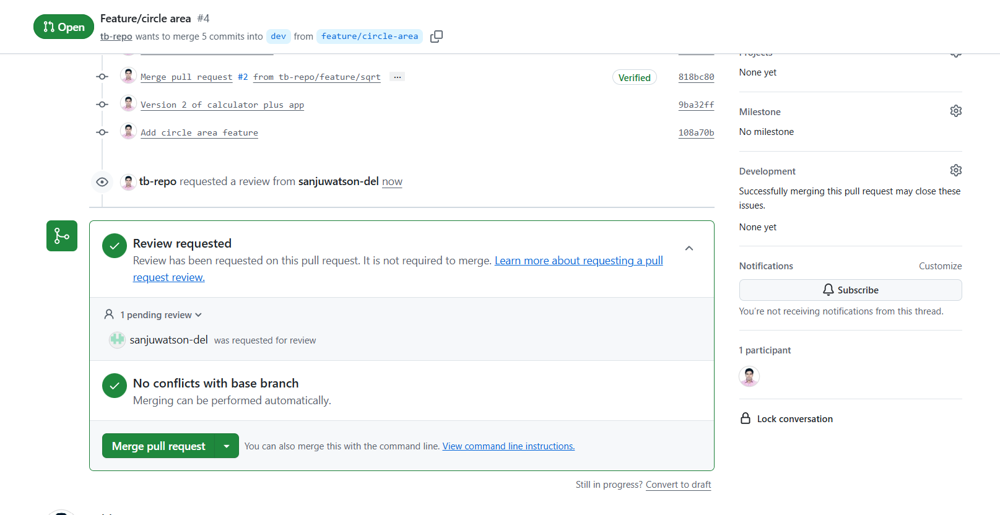
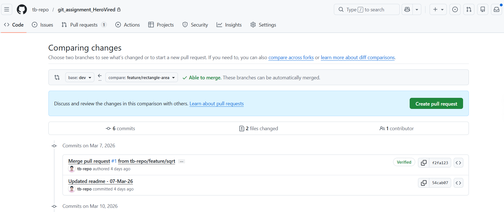
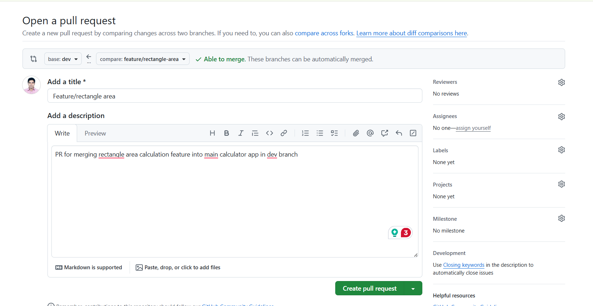
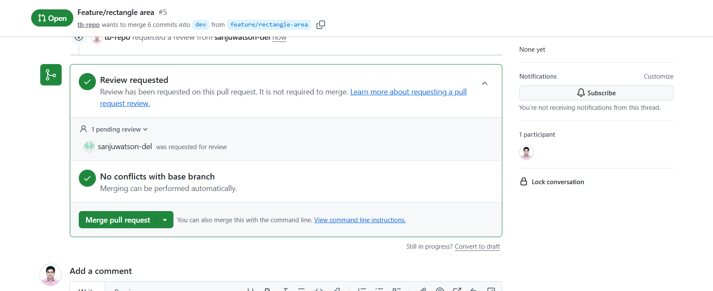
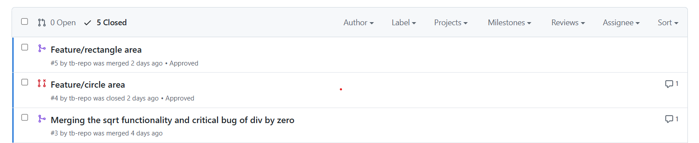

# Geometry Calculator – Git Stash Workflow

This section demonstrates implementing two features in a Python program using **Git feature branches and Git stash** to manage incomplete work.

Features implemented:

* Calculate **area of a circle**
* Calculate **area of a rectangle**

---

# Step-by-Step Implementation

## a. Create a new branch named `geometry-calculator`

```bash
git branch geometry-calculator
git checkout geometry-calculator
```

Output:

```
Switched to branch 'geometry-calculator'
```

---

## b. Update `app.py` to include the `GeometryCalculator` class

```python
import math

class GeometryCalculator:
    def calculate_circle_area(self, radius):
        return math.pi * radius ** 2

    def calculate_rectangle_area(self, length, width):
        return length * width

if __name__ == "__main__":
    calculator = GeometryCalculator()
```

Stage and commit the base code:

```bash
git add .
git commit -m "Geometry Calculator base code"
```

Output:

```
[geometry-calculator ab53e40] Geometry Calculator base code
1 file changed, 6 insertions(+), 28 deletions(-)
```

---

# Feature 1 – Circle Area

## c. Create `feature/circle-area` branch

```bash
git branch feature/circle-area
git checkout feature/circle-area
```

Output:

```
M       app.py
Switched to branch 'feature/circle-area'
```

---

## d. Add code to calculate the area of a circle

Add the following code:

```python
radius = 5
print(f"The area of the circle with radius {radius} = {calculator.calculate_circle_area(radius)}")
```

Run the program:

```bash
python app.py
```

Output:

```
The area of the circle with radius 5 = 78.53981633974483
```

---

## e. Stash Circle Area Feature changes

Save incomplete changes using Git stash.

```bash
git stash
```

Output:

```
Saved working directory and index state WIP on feature/circle-area: 9ba32ff Version 2 of calculator plus app
```

Verify stash:

```bash
git stash list
```

Output:

```
stash@{0}: WIP on feature/circle-area: 9ba32ff Version 2 of calculator plus app
```

Verify working directory is clean:

```bash
git status
```

Output:

```
On branch feature/circle-area
nothing to commit, working tree clean
```

---

# Feature 2 – Rectangle Area

## f. Create `feature/rectangle-area` branch

```bash
git branch feature/rectangle-area
git checkout feature/rectangle-area
```

Output:

```
Switched to branch 'feature/rectangle-area'
```

Add the following code:

```python
length = 10
width = 6
print(f"The area of the rectangle with length {length} and width {width} = {calculator.calculate_rectangle_area(length,width)}")
```

---

## g. Verify working directory and stash the changes

```bash
git status
```

Output:

```
On branch feature/rectangle-area
nothing to commit, working tree clean
```

Stash the changes:

```bash
git stash
```

Output:

```
Saved working directory and index state WIP on feature/rectangle-area: ab53e40 Geometry Calculator base code
```

---

# Resume Circle Feature

## h. Switch back to `feature/circle-area` and retrieve stashed changes

```bash
git checkout feature/circle-area
git stash pop
```

Output:

```
Switched to branch 'feature/circle-area'
```

---

## i. Commit and Push Circle Feature

```bash
git add .
git commit -m "Add circle area feature"
git push origin feature/circle-area
```

Output:

```
Create a pull request for 'feature/circle-area' on GitHub by visiting:
https://github.com/tb-repo/git_assignment_HeroVired/pull/new/feature/circle-area
```

---

# Resume Rectangle Feature

## j. Resume Rectangle Feature

```bash
git checkout feature/rectangle-area
git stash pop
```

Output:

```
Switched to branch 'feature/rectangle-area'
```

---

## k. Commit and Push Rectangle Feature

```bash
git add .
git commit -m "Add rectangle area feature"
git push origin feature/rectangle-area
```

Output:

```
Create a pull request for 'feature/rectangle-area' on GitHub by visiting:
https://github.com/tb-repo/git_assignment_HeroVired/pull/new/feature/rectangle-area
```

---

# Pull Request Workflow

## l. Create Pull Requests

Create the following Pull Requests on GitHub:

| Source Branch          | Target Branch |
| ---------------------- | ------------- |
| feature/circle-area    | dev           |
| feature/rectangle-area | dev           |

Request a code review from a collaborator.









---

# Review and Merge

1. After review approval, merge both Pull Requests into the **`dev` branch**.
2. Once validated, merge **`dev` → `main`** to include both features in the main codebase.

```bash
git checkout main
git merge dev
git push origin main
```

---

# Final Branch Structure

```
main
 │
 └── dev
      │
      ├── feature/circle-area
      └── feature/rectangle-area
```

---

# Git Concepts Demonstrated

* Feature branch workflow
* Using **Git stash** for incomplete work
* Switching between branches
* Pull request workflow
* Code review and controlled merges
