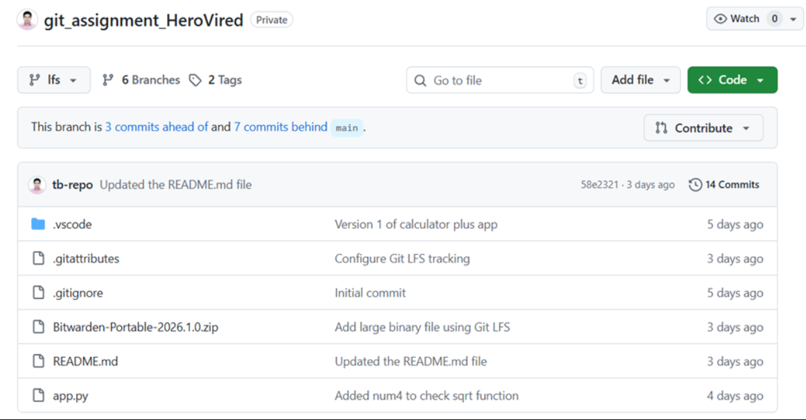
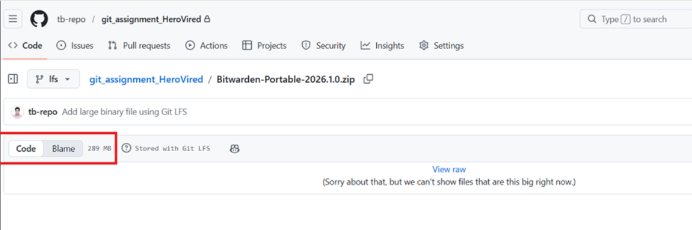

# Git Assignment – HeroVired Batch 16A - Owned by Thiagarajan Baskarasubramanian - ID 12950

Repository: **git_assignment_HeroVired**

This repository demonstrates multiple Git workflows while building simple Python utilities.
The assignment includes the following tasks:

* **Q1 – Calculator Plus Application (branching, PR, tagging)**
* **Q2 – Git Large File Storage (LFS)**
* **Q3 – Geometry Calculator using Git Stash**

All steps below include the **actual commands and outputs captured during execution**.

---

# Q1 – Calculator Plus Application

## a. Create Repository

Repository named **git_assignment_HeroVired** was created in the GitHub account **tb-repo** and set as a **private repository**.

---

# b. Clone Repository to Local Machine

```bash id="q8i5nd"
git clone git@github.com:tb-repo/git_assignment_HeroVired.git
```

---

# c. Create and Switch to `dev` Branch

```bash id="6du9df"
git branch dev
git checkout dev
```

---

# d. Add Calculator Application Code

```python id="o1d4pi"
import math
class Calculator:
    def add(self, a, b):
        return a + b
    def subtract(self, a, b):
        return a - b
    def multiply(self, a, b):
        return a * b
    def divide(self, a, b):
        return a / b
```

---

# e. Execute Program

```bash id="l3yd83"
(base) PS> python app.py
```

Output:

```id="9n1cjo"
16 + 4 = 20
16 - 4 = 12
16 * 4 = 64
16 / 4 = 4.0
```

---

# f. Commit Version 1

```bash id="z3jpr6"
git add .
git commit -m "Version 1 of calculator plus app"
```

Output:

```id="f29p5m"
[dev 5e902d7] Version 1 of calculator plus app
3 files changed, 57 insertions(+), 1 deletion(-)
create mode 100644 .vscode/settings.json
create mode 100644 app.py
```

Push branch:

```bash id="9m7xt9"
git push -u origin dev
```

Output:

```id="h5ynx3"
branch 'dev' set up to track 'origin/dev'
```

---

# g. Merge `dev` → `main` and Create Release v1

```bash id="ny9c2i"
git checkout main
git merge dev
git tag v1.0
git push origin v1.0
```

Output:

```id="7rq34j"
[new tag] v1.0 -> v1.0
```

---

# h. Create Feature Branch `feature/sqrt`

```bash id="c9w44y"
git checkout main
git branch feature/sqrt
git checkout feature/sqrt
```

---

# i. Implement Square Root Feature

Added:

```python id="ksq8cc"
def square_root(self, x):
    return math.sqrt(x)
```

Output:

```id="5r94k8"
√16 = 4.0
√4 = 2.0
```

---

# j. Commit and Push Feature Branch

```bash id="2s3uwp"
git add .
git commit -m "Added square root feature"
git push origin feature/sqrt
```

Output:

```id="xqklmo"
Create a pull request for 'feature/sqrt'
https://github.com/tb-repo/git_assignment_HeroVired/pull/new/feature/sqrt
```

---

# k. Fix Critical Bug in `dev`

Updated divide function:

```python id="jhswok"
def divide(self, a, b):
    if b == 0:
        raise ValueError("Cannot divide by zero.")
    return a / b
```

Commit fix:

```bash id="qsvr9r"
git checkout dev
git add .
git commit -m "Fix division by zero bug"
git push origin dev
```

Output:

```id="02cey1"
[dev b3f3020] Fix division by zero bug
1 file changed, 3 insertions(+), 1 deletion(-)
```

---

# l. Create Pull Request

PR created:

Title:

```id="yzpx1m"
Add square root feature to CalculatorPlus
```

Reviewer:

```id="7lgpgb"
sanjuwatson-del
```

After approval:

* `feature/sqrt → dev`
* `dev → main`

---

# m. Create Release Version 2

```bash id="a2vq1p"
git tag v2.0
git push origin v2.0
```

---

# Q2 – Git Large File Storage (LFS)

## a. Create `lfs` Branch

```bash id="me1xg6"
git branch lfs
git checkout lfs
```

---

# b. Verify Git LFS Installation

```bash id="0fgj6i"
git lfs status
```

Output:

```id="6px8q6"
On branch lfs

Objects to be committed:

Objects not staged for commit:
```

This confirms **Git LFS is installed**.

---

# c. Track Large Files

```bash id="eegqye"
git lfs track "*.zip"
```

Output:

```id="vfdibq"
Tracking "*.zip"
```

---

# d. Commit `.gitattributes`

```bash id="p3yd8m"
git add .gitattributes
git commit -m "Configure Git LFS tracking"
```

Output:

```id="3np7v4"
[lfs c2f0ba4] Configure Git LFS tracking
1 file changed, 1 insertion(+)
create mode 100644 .gitattributes
```

---

# e. Add Large Binary File

File added:

```id="ff2vyo"
Bitwarden-Portable-2026.1.0.zip
```

Commit:

```bash id="ibk7f3"
git add Bitwarden-Portable-2026.1.0.zip
git commit -m "Add large binary file using Git LFS"
```

Output:

```id="7v76wh"
[lfs a758743] Add large binary file using Git LFS
1 file changed, 3 insertions(+)
create mode 100644 Bitwarden-Portable-2026.1.0.zip
```

---

# f. Push Branch

```bash id="ck9bnl"
git push origin lfs
```

Output:

```id="awzq9k"
Uploading LFS objects: 100% (1/1), 303 MB | 10 MB/s
```

---

# g. Verify LFS Tracking

```bash id="2b3c6o"
git lfs ls-files
```

Output:

```id="o0g3rq"
948387e847 * Bitwarden-Portable-2026.1.0.zip
```


---

# Q3 – Geometry Calculator using Git Stash

## a. Create Branch

```bash id="0p9o2r"
git branch geometry-calculator
git checkout geometry-calculator
```

Output:

```id="zqfo3o"
Switched to branch 'geometry-calculator'
```

---

# b. Add Base Geometry Code

```python id="dffyql"
import math
class GeometryCalculator:
    def calculate_circle_area(self, radius):
        return math.pi * radius ** 2
    def calculate_rectangle_area(self, length, width):
        return length * width
```

Commit:

```bash id="hpx2pr"
git add .
git commit -m "Geometry Calculator base code"
```

Output:

```id="p5h1ds"
[geometry-calculator ab53e40] Geometry Calculator base code
1 file changed, 6 insertions(+), 28 deletions(-)
```

---

# Circle Area Feature

```bash id="l9bn7p"
git branch feature/circle-area
git checkout feature/circle-area
```

Run program:

```id="c7qcz3"
The area of the circle with radius 5 = 78.53981633974483
```

Stash changes:

```bash id="3ol1qk"
git stash
git stash list
```

---

# Rectangle Area Feature

```bash id="5x62ox"
git branch feature/rectangle-area
git checkout feature/rectangle-area
```

Stash incomplete work:

```bash id="c8q3ir"
git stash
```

---

# Resume Circle Feature

```bash id="s3g3ra"
git checkout feature/circle-area
git stash pop
```

Commit:

```bash id="mxt2p7"
git commit -m "Add circle area feature"
git push origin feature/circle-area
```

---

# Resume Rectangle Feature

```bash id="s29h4y"
git checkout feature/rectangle-area
git stash pop
```

Commit:

```bash id="aj0g20"
git commit -m "Add rectangle area feature"
git push origin feature/rectangle-area
```

---

# Pull Requests

Two PRs created:

| Source                 | Target |
| ---------------------- | ------ |
| feature/circle-area    | dev    |
| feature/rectangle-area | dev    |

After approval:

* merged to **dev**
* then **dev merged to main**


## Final Merge to Main Branch and Release v3.0

After completing the Geometry Calculator features and Pull Request approvals, the `dev` branch was merged into the `main` branch.

### Step 1: Switch to the `main` branch

```bash
(base) PS D:\HeroVired\Assignments\git_assignment_HeroVired\git_assignment_HeroVired> git checkout main
Switched to branch 'main'
Your branch is up to date with 'origin/main'.
```

---

### Step 2: Merge the `dev` branch into `main`

```bash
git merge dev
Updating 9ba32ff..d715cb3
Fast-forward
 README.md            | 671 +++++++++++++++++++++++++++++++++++----------------
 app.py               |  39 ++-
 images/Q3_PR_SS1.png | Bin 0 -> 92883 bytes
 images/Q3_PR_SS2.png | Bin 0 -> 81862 bytes
 images/Q3_PR_SS3.png | Bin 0 -> 109718 bytes
 images/Q3_PR_SS4.png | Bin 0 -> 98297 bytes
 images/Q3_PR_SS5.png | Bin 0 -> 93400 bytes
 images/Q3_PR_SS6.png | Bin 0 -> 90040 bytes
 images/Q3_PR_SS7.png | Bin 0 -> 34678 bytes
 9 files changed, 491 insertions(+), 219 deletions(-)
 create mode 100644 images/Q3_PR_SS1.png
 create mode 100644 images/Q3_PR_SS2.png
 create mode 100644 images/Q3_PR_SS3.png
 create mode 100644 images/Q3_PR_SS4.png
 create mode 100644 images/Q3_PR_SS5.png
 create mode 100644 images/Q3_PR_SS6.png
 create mode 100644 images/Q3_PR_SS7.png
```

---

### Step 3: Commit the Final Updates

```bash
git add .

git commit -m "Release v3.0 - Geometry calculator features using Git stash"
```

Output:

```bash
[main 0b1f683] Release v3.0 - Geometry calculator features using Git stash
 3 files changed, 209 insertions(+), 171 deletions(-)
 create mode 100644 images/Q2_LFS_SS1.png
 create mode 100644 images/Q2_LFS_SS2.png
```

---

### Step 4: Push Changes to GitHub

```bash
git push origin main
```

Output:

```bash
Enumerating objects: 9, done.
Counting objects: 100% (9/9), done.
Delta compression using up to 8 threads
Compressing objects: 100% (6/6), done.
Writing objects: 100% (6/6), 276.41 KiB | 1.61 MiB/s, done.
Total 6 (delta 3), reused 0 (delta 0), pack-reused 0 (from 0)
remote: Resolving deltas: 100% (3/3), completed with 3 local objects.
To github.com:tb-repo/git_assignment_HeroVired.git
   9ba32ff..0b1f683  main -> main
```

---

### Step 5: Create Release Tag `v3.0`

An annotated tag was created to mark the **Version 3.0 release**.

```bash
git tag -a v3.0 -m "Release v3.0 - Geometry calculator features using Git stash"
```

---

### Step 6: Push the Tag to GitHub

```bash
git push origin v3.0
```

Output:

```bash
Enumerating objects: 1, done.
Counting objects: 100% (1/1), done.
Writing objects: 100% (1/1), 205 bytes | 205.00 KiB/s, done.
Total 1 (delta 0), reused 0 (delta 0), pack-reused 0 (from 0)

To github.com:tb-repo/git_assignment_HeroVired.git
 * [new tag]         v3.0 -> v3.0
```

---

### Final Release Summary

| Version | Description                                                       |
| ------- | ----------------------------------------------------------------- |
| v1.0    | Initial Calculator Application                                    |
| v2.0    | Square Root Feature + Divide-by-Zero Bug Fix                      |
| v3.0    | Geometry Calculator Features (Circle & Rectangle) using Git Stash |


---

# Final Branch Structure

```id="pfrfif"
main
 │
 └── dev
      │
      ├── feature/sqrt
      ├── feature/circle-area
      ├── feature/rectangle-area
      └── lfs
```

---

# Git Concepts Demonstrated

* Git branching strategy
* Feature branches
* Pull Requests and code reviews
* Git tags and releases
* Git LFS for large files
* Git stash workflow
